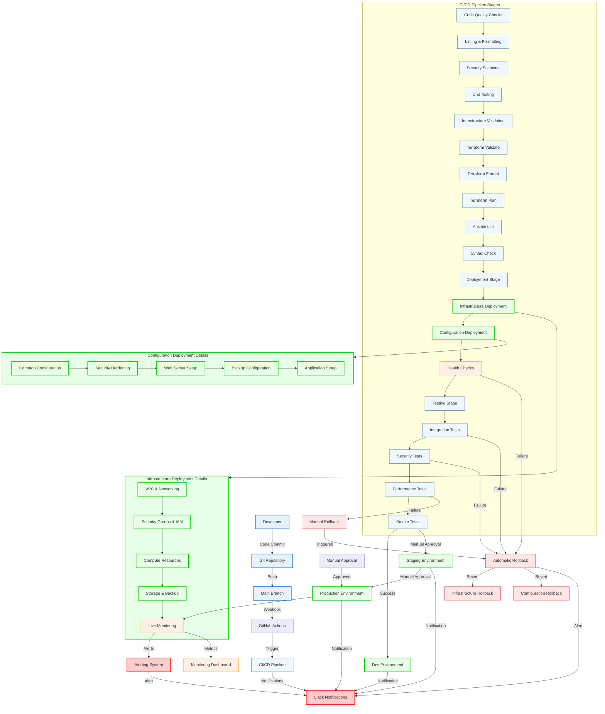

# Deployment Flow Diagram

## Overview

This document illustrates the complete CI/CD deployment flow for the AWS-Terraform-Ansible infrastructure project. The flow covers code changes, testing, infrastructure deployment, and monitoring.

## Mermaid Deployment Flow Diagram



## Detailed Deployment Phases

### Phase 1: Code Commit and Validation

#### 1.1 Developer Workflow

- **Local Development**: Developers work on feature branches
- **Code Quality**: Automated linting and formatting
- **Unit Testing**: Unit tests for all components
- **Security Scanning**: Static code analysis

#### 1.2 Code Repository

- **Git Workflow**: Feature branch → Pull Request → Main branch
- **Code Review**: Peer review required for all changes
- **Merge Strategy**: Squash merge for clean history
- **Tagging**: Automatic tagging for releases

#### 1.3 Initial Validation

```bash
# Terraform validation
terraform validate
terraform fmt -check

# Ansible validation
ansible-lint ansible/
ansible-playbook --syntax-check

# Security scanning
checkov --directory terraform/
tfsec terraform/
```

### Phase 2: CI/CD Pipeline Execution

#### 2.1 Pipeline Trigger

- **Webhook**: GitHub webhook triggers on push to main
- **Manual Trigger**: Manual pipeline execution available
- **Scheduled Trigger**: Nightly security scans
- **PR Trigger**: Run on pull requests

#### 2.2 Code Quality Stage

```yaml
# Example GitHub Actions step
- name: Code Quality Checks
  run: |
    terraform fmt -check
    terraform validate
    ansible-lint ansible/
    shellcheck scripts/*.sh
```

#### 2.3 Security Scanning

```bash
# Security tools execution
checkov --directory terraform/ --framework terraform
tfsec terraform/
bandit -r ansible/roles/
```

#### 2.4 Infrastructure Validation

```bash
# Terraform plan with validation
terraform plan -out=tfplan
terraform show -json tfplan | jq -r '.planned_values'
```

### Phase 3: Infrastructure Deployment

#### 3.1 Deployment Strategy

- **Dev Environment**: Automatic deployment on success
- **Staging Environment**: Manual approval required
- **Production Environment**: Multiple approvals required
- **Blue-Green**: Zero-downtime deployments

#### 3.2 Infrastructure Components

```hcl
# Deployment order
module "vpc" {
  source = "./modules/vpc"
}

module "security" {
  source = "./modules/security"
  depends_on = [module.vpc]
}

module "compute" {
  source = "./modules/compute"
  depends_on = [module.vpc, module.security]
}
```

#### 3.3 Configuration Deployment

```yaml
# Ansible deployment order
- name: Deploy common configuration
  hosts: all
  roles: [common]

- name: Apply security hardening
  hosts: all
  roles: [security]

- name: Configure web servers
  hosts: webservers
  roles: [webserver]
```

### Phase 4: Testing and Validation

#### 4.1 Health Checks

```bash
# Application health checks
curl -f https://app.example.com/health
curl -f https://api.example.com/health

# Infrastructure health checks
aws elb describe-instance-health --load-balancer-name web-lb
```

#### 4.2 Integration Tests

```bash
# End-to-end testing
./tests/integration/smoke-test.sh
./tests/integration/api-test.sh
./tests/integration/ui-test.sh
```

#### 4.3 Security Tests

```bash
# Security validation
./tests/security/compliance-test.sh
./tests/security/penetration-test.sh
./tests/security/vulnerability-scan.sh
```

#### 4.4 Performance Tests

```bash
# Performance validation
./tests/performance/load-test.sh
./tests/performance/stress-test.sh
./tests/performance/endurance-test.sh
```

### Phase 5: Production Deployment

#### 5.1 Approval Process

- **Technical Review**: Architecture team approval
- **Security Review**: Security team approval
- **Business Review**: Product owner approval
- **Change Management**: Change advisory board approval

#### 5.2 Deployment Windows

- **Maintenance Windows**: Scheduled during low-traffic periods
- **Blue-Green**: Zero-downtime deployment
- **Canary**: Gradual traffic shifting
- **Rolling**: Instance-by-instance updates

#### 5.3 Post-Deployment Validation

```bash
# Production validation
curl -f https://prod.example.com/health
aws cloudwatch get-metric-statistics --namespace AWS/ApplicationELB
./tests/production/smoke-test.sh
```

## Rollback Procedures

### Automatic Rollback Triggers

- **Health Check Failures**: Immediate rollback
- **Performance Degradation**: Automated threshold-based rollback
- **Security Scan Failures**: Immediate rollback
- **Integration Test Failures**: Automatic rollback

### Manual Rollback Process

```bash
# Terraform rollback
terraform apply -target=resource.to.rollback -replace

# Ansible configuration rollback
ansible-playbook playbooks/rollback.yml --extra-vars "backup_id=latest"

# Database rollback
aws rds restore-db-instance-from-db-snapshot \
  --db-instance-identifier prod-db \
  --db-snapshot-identifier backup-snapshot-id
```

## Monitoring and Alerting

### Real-time Monitoring

- **Application Metrics**: Response time, error rate, throughput
- **Infrastructure Metrics**: CPU, memory, disk, network
- **Business Metrics**: User activity, transaction volume
- **Security Metrics**: Failed logins, suspicious activities

### Alerting Rules

```yaml
# Example CloudWatch alarms
Resources:
  HighErrorRate:
    Type: AWS::CloudWatch::Alarm
    Properties:
      MetricName: ErrorRate
      Threshold: 5
      ComparisonOperator: GreaterThanThreshold
      EvaluationPeriods: 2

  HighResponseTime:
    Type: AWS::CloudWatch::Alarm
    Properties:
      MetricName: ResponseTime
      Threshold: 2000
      ComparisonOperator: GreaterThanThreshold
      EvaluationPeriods: 3
```

### Notification Channels

- **Slack**: Real-time notifications
- **Email**: Non-critical alerts
- **PagerDuty**: Critical incidents
- **SMS**: Emergency notifications

## Environment Management

### Environment Promotion Path

1. **Development** → **Testing** → **Staging** → **Production**
2. Each environment has its own infrastructure and configuration
3. Promotion requires successful testing in current environment
4. Rollback capability to previous environment state

### Configuration Management

- **Environment Variables**: Separate for each environment
- **Secrets Management**: Environment-specific secrets
- **Feature Flags**: Environment-based feature toggles
- **Configuration Drift**: Regular detection and correction

## Performance Optimization

### Deployment Performance

- **Parallel Execution**: Parallel Terraform and Ansible runs
- **Incremental Deployments**: Only deploy changed components
- **Resource Caching**: Cache frequently used resources
- **Network Optimization**: Minimize cross-region traffic

### Pipeline Performance

- **Docker Caching**: Cache Docker layers
- **Dependency Caching**: Cache npm/pip dependencies
- **Artifact Caching**: Cache build artifacts
- **Parallel Stages**: Run independent stages in parallel

## Security Integration

### Deployment Security

- **IAM Roles**: Least-privilege deployment roles
- **MFA Required**: Multi-factor authentication for production
- **Audit Logging**: Complete audit trail
- **Network Security**: Deploy through secure channels

### Code Security

- **Static Analysis**: Automated security scanning
- **Dependency Scanning**: Check for vulnerable dependencies
- **Secret Detection**: Scan for committed secrets
- **Compliance Checking**: Validate against security policies

## Documentation and Knowledge Management

### Documentation Updates

- **Automatic Documentation**: Generate from infrastructure code
- **Architecture Diagrams**: Keep diagrams up to date
- **API Documentation**: Auto-generate from code
- **Runbooks**: Update with new procedures

### Knowledge Sharing

- **Post-Mortems**: Document failures and learnings
- **Best Practices**: Share deployment best practices
- **Training Materials**: Onboarding documentation
- **Community Contributions**: Open source contributions

## Continuous Improvement

### Metrics and KPIs

- **Deployment Frequency**: Number of deployments per week
- **Lead Time**: Time from commit to production
- **Change Failure Rate**: Percentage of failed deployments
- **Mean Time to Recovery**: Time to restore service

### Optimization Opportunities

- **Pipeline Efficiency**: Identify bottlenecks and optimize
- **Resource Utilization**: Optimize resource usage
- **Cost Reduction**: Identify cost-saving opportunities
- **Automation**: Increase automation coverage

---

_Diagram Version: 1.0_
_Last Updated: November 2025_
_Next Review: February 2026_
