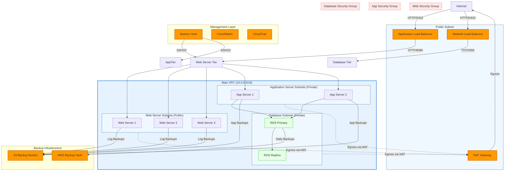

# Network Topology Diagram

## Overview

This document describes the network topology of the AWS-Terraform-Ansible infrastructure project using Mermaid diagrams. These diagrams can be rendered using any Mermaid-compatible tool or converted to PNG/SVG images.

## Mermaid Network Topology Diagram



## Detailed Network Components

### VPC Configuration

- **VPC CIDR**: 10.0.0.0/16
- **Region**: us-east-1
- **DNS Support**: Enabled
- **DNS Hostnames**: Enabled

### Subnet Layout

#### Public Subnets

- **Web Subnet A**: 10.0.1.0/24 (us-east-1a)
- **Web Subnet B**: 10.0.2.0/24 (us-east-1b)
- **NAT Subnet**: 10.0.0.0/24 (us-east-1a)

#### Private Subnets

- **App Subnet A**: 10.0.11.0/24 (us-east-1a)
- **App Subnet B**: 10.0.12.0/24 (us-east-1b)
- **DB Subnet A**: 10.0.21.0/24 (us-east-1a)
- **DB Subnet B**: 10.0.22.0/24 (us-east-1b)

### Routing Tables

#### Public Route Table

```
Destination     Target
0.0.0.0/0      Internet Gateway
10.0.0.0/16     Local
```

#### Private Route Tables

```
Destination     Target
0.0.0.0/0      NAT Gateway
10.0.0.0/16     Local
```

### Security Groups

#### Web Server Security Group

- **Inbound**:
  - 443/tcp from 0.0.0.0/0 (HTTPS)
  - 80/tcp from 0.0.0.0/0 (HTTP - redirect to HTTPS)
  - 22/tcp from Bastion SG (SSH)
- **Outbound**:
  - 8080/tcp to App SG (Application communication)
  - 443/tcp to 0.0.0.0/0 (HTTPS outbound)
  - 53/udp to 0.0.0.0/0 (DNS)

#### Application Server Security Group

- **Inbound**:
  - 8080/tcp from Web SG (Application port)
  - 22/tcp from Bastion SG (SSH)
- **Outbound**:
  - 3306/tcp to DB SG (Database)
  - 443/tcp to 0.0.0.0/0 (HTTPS outbound)

#### Database Security Group

- **Inbound**:
  - 3306/tcp from App SG (MySQL)
- **Outbound**:
  - None (restricted)

## Network Flow Patterns

### User Traffic Flow

1. User → Internet → ALB (HTTPS/443)
2. ALB → Web Servers (HTTP/8080)
3. Web Servers → App Servers (HTTP/8080)
4. App Servers → Database (MySQL/3306)

### Management Traffic Flow

1. Admin → Internet → Bastion Host (SSH/22)
2. Bastion → Web/App Servers (SSH/22)
3. All components → CloudWatch (Logs/Metrics)

### Backup Traffic Flow

1. Application Servers → S3 (Backup data)
2. Database → AWS Backup (Automated snapshots)
3. All logs → CloudWatch Logs

## High Availability Design

### Multi-AZ Deployment

- **Web Tier**: 3 instances across 2 AZs
- **App Tier**: 2 instances across 2 AZs
- **Database**: Primary + 1 replica in different AZ
- **Load Balancers**: Cross-zone load balancing enabled

### Failover Mechanisms

- **Application Load Balancer**: Health checks every 30 seconds
- **Database**: Automatic failover to replica
- **NAT Gateway**: One per AZ for redundancy
- **Bastion Host**: Single instance (can be made multi-AZ)

## Security Zones

### DMZ (Demilitarized Zone)

- **Components**: Load Balancers, NAT Gateway
- **Access**: Direct internet access
- **Security**: Limited to HTTP/HTTPS traffic

### Application Zone

- **Components**: Web Servers, Application Servers
- **Access**: From DMZ only
- **Security**: Restricted outbound traffic

### Data Zone

- **Components**: Database, Backup Storage
- **Access**: From Application Zone only
- **Security**: Most restrictive rules

## Monitoring and Observability

### Network Monitoring

- **VPC Flow Logs**: Enabled for all subnets
- **CloudWatch Metrics**: Latency, error rates, connection counts
- **Health Checks**: Application and database health monitoring

### Security Monitoring

- **GuardDuty**: Threat detection
- **Security Hub**: Centralized security findings
- **CloudTrail**: API call logging

## Scaling Considerations

### Horizontal Scaling

- **Web Servers**: Auto Scaling Group (2-10 instances)
- **App Servers**: Auto Scaling Group (2-6 instances)
- **Database**: Read replicas for read-heavy workloads

### Vertical Scaling

- **Instance Types**: Can be upgraded with minimal downtime
- **Storage**: EBS volumes can be resized online
- **Database**: RDS instance scaling with minimal impact

## Cost Optimization

### Network Cost Reduction

- **Data Transfer**: Minimize cross-AZ traffic
- **NAT Gateway**: Use NAT instances for lower cost (if applicable)
- **CloudFront**: CDN for static content (future enhancement)

### Resource Utilization

- **Auto Scaling**: Scale based on actual demand
- **Scheduled Scaling**: For predictable traffic patterns
- **Rightsizing**: Regular review of instance utilization

## Compliance and Governance

### Network Compliance

- **CIS Controls**: Implemented network security controls
- **PCI DSS**: Segmentation and access controls (if applicable)
- **HIPAA**: Encryption and audit logging (if applicable)

### Change Management

- **Infrastructure as Code**: All network changes versioned
- **Peer Review**: Required for all network changes
- **Automated Testing**: Network changes validated before deployment

## Future Enhancements

### Planned Improvements

- **Transit Gateway**: For multi-VPC connectivity
- **AWS PrivateLink**: For secure service communication
- **AWS Global Accelerator**: For improved performance
- **Service Mesh**: AWS App Mesh for microservices

### Hybrid Connectivity

- **VPN**: Site-to-site VPN for datacenter connectivity
- **Direct Connect**: Dedicated connectivity for high throughput
- **Outposts**: AWS infrastructure on-premises

---

_Diagram Version: 1.0_
_Last Updated: November 2025_
_Next Review: February 2026_
