# Security Architecture Diagram

## Overview

This document illustrates the comprehensive security architecture of the AWS-Terraform-Ansible infrastructure project, including defense-in-depth layers, security controls, and monitoring capabilities.

## Mermaid Security Architecture Diagram

```mermaid
graph TB
    %% External Threat Landscape
    subgraph External["External Threat Landscape"]
        direction LR
        Internet[Internet]
        Attackers[Malicious Actors]
        ThreatIntel[Threat Intelligence]
    end

    %% Perimeter Security
    subgraph Perimeter["Perimeter Security Layer"]
        direction TB
        WAF[Web Application Firewall]
        CloudFront[CloudFront CDN]
        Shield[AWS Shield Advanced]
        DDoSProtection[DDoS Protection]

        Internet --> CloudFront
        CloudFront --> WAF
        WAF --> Shield
        Shield --> DDoSProtection
    end

    %% Network Security
    subgraph NetworkSec["Network Security Layer"]
        direction TB

        subgraph VPCSec["VPC Security"]
            VPC[Main VPC]
            PrivateSubnets[Private Subnets]
            PublicSubnets[Public Subnets]
            NATGW[NAT Gateways]
            IGW[Internet Gateway]
        end

        subgraph SGs["Security Groups"]
            WebSG[Web SG]
            AppSG[App SG]
            DBSG[Database SG]
            MgmtSG[Management SG]
        end

        subgraph NACLs["Network ACLs"]
            WebNACL[Web NACL]
            AppNACL[App NACL]
            DBNACL[Database NACL]
        end

        DDoSProtection --> VPC
        VPC --> PrivateSubnets
        VPC --> PublicSubnets
        VPC --> NATGW
        VPC --> IGW
    end

    %% Application Security
    subgraph AppSec["Application Security Layer"]
        direction TB

        subgraph ALBLayer["Application Load Balancers"]
            ALB[Application Load Balancer]
            NLB[Network Load Balancer]
            HealthChecks[Health Checks]
        end

        subgraph WebTier["Web Server Security"]
            Web1[Web Server 1]
            Web2[Web Server 2]
            Web3[Web Server 3]
            SSL[SSL/TLS Encryption]
            HSTS[HSTS Headers]
        end

        subgraph AppTier["Application Server Security"]
            App1[App Server 1]
            App2[App Server 2]
            Auth[Authentication]
            AuthZ[Authorization]
            InputValidation[Input Validation]
        end
    end

    %% Data Security
    subgraph DataSec["Data Security Layer"]
        direction TB

        subgraph Database["Database Security"]
            RDSPrimary[RDS Primary]
            RDSReplica[RDS Replica]
            EncryptionAtRest[Encryption at Rest]
            EncryptionInTransit[Encryption in Transit]
        end

        subgraph Storage["Storage Security"]
            S3Bucket[S3 Buckets]
            KMS[KMS Keys]
            BucketPolicies[Bucket Policies]
            Versioning[Object Versioning]
        end

        subgraph Backup["Backup Security"]
            BackupVault[AWS Backup]
            CrossRegionBackup[Cross-Region Backup]
            PointInTimeRecovery[Point-in-Time Recovery]
        end
    end

    %% Identity and Access Management
    subgraph IAMSec["Identity & Access Management"]
        direction TB

        subgraph UserMgmt["User Management"]
            IAMUsers[IAM Users]
            IAMGroups[IAM Groups]
            IAMRoles[IAM Roles]
            MFAMultiFactor[MFA Required]
        end

        subgraph AccessControl["Access Control"]
            LeastPrivilege[Least Privilege]
            PIM[Privileged Identity Management]
            AccessKeys[Access Key Rotation]
            PasswordPolicies[Password Policies]
        end

        subgraph Federation["Identity Federation"]
            SAML[SAML SSO]
            OIDC[OpenID Connect]
            ADFS[Active Directory]
        end
    end

    %% Monitoring and Threat Detection
    subgraph Monitoring["Security Monitoring & Threat Detection"]
        direction TB

        subgraph Logging["Logging Infrastructure"]
            CloudTrail[CloudTrail]
            CloudWatch[CloudWatch Logs]
            VPCFlowLogs[VPC Flow Logs]
            AuditLogs[Audit Logs]
        end

        subgraph ThreatDetection["Threat Detection"]
            GuardDuty[Amazon GuardDuty]
            SecurityHub[AWS Security Hub]
            Macie[Amazon Macie]
            Inspector[Amazon Inspector]
        end

        subgraph Alerting["Security Alerting"]
            CloudWatchAlarms[CloudWatch Alarms]
            SNSNotifications[SNS Notifications]
            SIEM[SIEM Integration]
            Ticketing[Ticketing System]
        end
    end

    %% Incident Response
    subgraph IncidentResponse["Incident Response"]
        direction TB

        subgraph Response["Response Capabilities"]
            Isolation[Resource Isolation]
            Remediation[Automated Remediation]
            Forensics[Forensic Analysis]
            EvidenceCollection[Evidence Collection]
        end

        subgraph Communication["Communication"]
            Escalation[Escalation Matrix]
            StakeholderNotifications[Stakeholder Notifications]
            ExecutiveReporting[Executive Reporting]
            RegulatoryReporting[Regulatory Reporting]
        end
    end

    %% Compliance and Governance
    subgraph Compliance["Compliance & Governance"]
        direction TB

        subgraph Standards["Compliance Standards"]
            CIS[CIS Controls]
            NIST[NIST Framework]
            PCI[PCI DSS]
            HIPAA[HIPAA]
        end

        subgraph Controls["Security Controls"]
            ConfigRules[AWS Config Rules]
            ControlTower[AWS Control Tower]
            ComplianceReporting[Compliance Reporting]
            AuditTrail[Audit Trail]
        end

        subgraph Automation["Governance Automation"]
            PolicyasCode[Policy as Code]
            AutomatedCompliance[Automated Compliance]
            DriftDetection[Drift Detection]
            ChangeManagement[Change Management]
        end
    end

    %% Connections and Data Flow
    DDoSProtection --> ALBLayer
    ALBLayer --> WebTier
    WebTier --> AppTier
    AppTier --> Database
    Database --> Storage
    Storage --> Backup

    %% Security Monitoring Connections
    WebSG -.->|Logs to| CloudTrail
    AppSG -.->|Logs to| CloudWatch
    DBSG -.->|Logs to| VPCFlowLogs
    IAMRoles -.->|Events to| GuardDuty
    S3Bucket -.->|Data Scan| Macie
    Web1 -.->|Vulnerability Scan| Inspector
    Web2 -.->|Vulnerability Scan| Inspector
    Web3 -.->|Vulnerability Scan| Inspector

    %% Alerting Connections
    GuardDuty -->|Alerts| SecurityHub
    Macie -->|Alerts| SecurityHub
    Inspector -->|Alerts| SecurityHub
    SecurityHub -->|Notifications| CloudWatchAlarms
    CloudWatchAlarms -->|Messages| SNSNotifications
    SNSNotifications -->|Tickets| Ticketing
    SNSNotifications -->|Alerts| SIEM

    %% Incident Response Connections
    SecurityHub -->|Triggers| Response
    CloudWatchAlarms -->|Triggers| Response
    Response -->|Notifications| Communication

    %% Compliance Connections
    ConfigRules -->|Findings| ComplianceReporting
    ControlTower -->|Controls| ComplianceReporting
    AutomatedCompliance -->|Results| ComplianceReporting
    ComplianceReporting -->|Reports| RegulatoryReporting

    %% Styling
    classDef threat fill:#ffcccc,stroke:#ff0000,stroke-width:2px
    classDef perimeter fill:#ffe6cc,stroke:#ff9900,stroke-width:1px
    classDef network fill:#e6f3ff,stroke:#0066cc,stroke-width:1px
    classDef application fill:#e6ffe6,stroke:#00cc00,stroke-width:1px
    classDef data fill:#f0f8ff,stroke:#336699,stroke-width:1px
    classDef identity fill:#fff0e6,stroke:#ff9900,stroke-width:1px
    classDef monitoring fill:#f5f5f5,stroke:#666666,stroke-width:1px
    classDef incident fill:#ffebcc,stroke:#ff6600,stroke-width:1px
    classDef compliance fill:#e6ffcc,stroke:#00cc66,stroke-width:1px

    class Internet,Attackers,ThreatIntel threat
    class WAF,CloudFront,Shield,DDoSProtection perimeter
    class VPCSec,SGs,NACLs,VPC,PrivateSubnets,PublicSubnets,NATGW,IGW,WebSG,AppSG,DBSG,MgmtSG,WebNACL,AppNACL,DBNACL network
    class ALBLayer,WebTier,AppTier,ALB,NLB,HealthChecks,Web1,Web2,Web3,SSL,HSTS,App1,App2,Auth,AuthZ,InputValidation application
    class DataSec,Database,Storage,Backup,RDSPrimary,RDSReplica,EncryptionAtRest,EncryptionInTransit,S3Bucket,KMS,BucketPolicies,Versioning,BackupVault,CrossRegionBackup,PointInTimeRecovery data
    class IAMSec,UserMgmt,AccessControl,Federation,IAMUsers,IAMGroups,IAMRoles,MFAMultiFactor,LeastPrivilege,PIM,AccessKeys,PasswordPolicies,SAML,OIDC,ADFS identity
    class Monitoring,Logging,ThreatDetection,Alerting,CloudTrail,CloudWatch,VPCFlowLogs,AuditLogs,GuardDuty,SecurityHub,Macie,Inspector,CloudWatchAlarms,SNSNotifications,SIEM,Ticketing monitoring
    class IncidentResponse,Response,Communication,Isolation,Remediation,Forensics,EvidenceCollection,Escalation,StakeholderNotifications,ExecutiveReporting,RegulatoryReporting incident
    class Compliance,Standards,Controls,Automation,CIS,NIST,PCI,HIPAA,ConfigRules,ControlTower,ComplianceReporting,AuditTrail,PolicyasCode,AutomatedCompliance,DriftDetection,ChangeManagement compliance
```



## Security Control Categories

### 1. Perimeter Security

#### Web Application Firewall (WAF)

- **Protection**: SQL injection, XSS, CSRF protection
- **Rate Limiting**: Request throttling and DDoS mitigation
- **Bot Management**: Bot detection and mitigation
- **Geo-blocking**: Geographic access restrictions

#### DDoS Protection

- **AWS Shield Standard**: Automatic protection for all AWS resources
- **AWS Shield Advanced**: 24/7 AWS DDoS Response Team (DRT)
- **CloudFront**: Edge location protection
- **Network ACLs**: Additional layer of network protection

#### CDN Security

- **CloudFront**: Content delivery with edge security
- **SSL/TLS**: Enforce HTTPS at all edge locations
- **Geo Restrictions**: Control content distribution by geography
- **Signed URLs/ Cookies**: Prevent unauthorized access

### 2. Network Security

#### VPC Security

```hcl
# Example VPC configuration with security
resource "aws_vpc" "main" {
  cidr_block           = "10.0.0.0/16"
  enable_dns_support   = true
  enable_dns_hostnames = true

  tags = {
    Name        = "main-vpc"
    Environment = var.environment
    Security    = "high"
  }
}
```

#### Security Groups

- **Least Privilege**: Only required ports open
- **Multi-layer**: Tiered security group architecture
- **Dynamic Updates**: Automated rule updates
- **Monitoring**: Security group rule change alerts

#### Network ACLs

- **Stateless Filtering**: Additional network layer protection
- **Subnet Level**: Control traffic between subnets
- **Default Deny**: Implicit deny for all traffic
- **Logging**: All allowed/denied traffic logged

### 3. Application Security

#### SSL/TLS Implementation

```nginx
# SSL configuration example
ssl_protocols TLSv1.2 TLSv1.3;
ssl_ciphers ECDHE-RSA-AES256-GCM-SHA512:DHE-RSA-AES256-GCM-SHA512;
ssl_prefer_server_ciphers off;
ssl_session_cache shared:SSL:10m;
ssl_session_timeout 10m;
```

#### Input Validation

- **API Gateway**: Request validation and throttling
- **WAF Rules**: Application layer protection
- **Code Review**: Security-focused code reviews
- **Penetration Testing**: Regular security assessments

#### Authentication & Authorization

- **Multi-factor Authentication**: Required for all administrative access
- **Role-based Access Control**: Principle of least privilege
- **Session Management**: Secure session handling
- **API Security**: API key management and rotation

### 4. Data Security

#### Encryption at Rest

```yaml
# Example KMS encryption
AWSKMSKey:
  Type: AWS::KMS::Key
  Properties:
    Description: "Customer managed key for data encryption"
    EnableKeyRotation: true
    KeyPolicy:
      Version: "2012-10-17"
      Statement:
        - Effect: Allow
          Principal:
            AWS: !Sub "arn:aws:iam::${AWS::AccountId}:root"
          Action: "kms:*"
          Resource: "*"
```

#### Encryption in Transit

- **TLS 1.2+**: Minimum TLS version requirement
- **Perfect Forward Secrecy**: Modern cipher suites
- **Certificate Management**: Automated certificate rotation
- **Network Security**: Private network communication

#### Data Classification

- **Automated Tagging**: Data classification by type
- **Access Control**: Role-based data access
- **Retention Policies**: Data lifecycle management
- **Data Loss Prevention**: Prevent unauthorized data exfiltration

### 5. Identity and Access Management

#### IAM Best Practices

```yaml
# Example IAM role with least privilege
WebServerRole:
  Type: AWS::IAM::Role
  Properties:
    AssumeRolePolicyDocument:
      Version: "2012-10-17"
      Statement:
        - Effect: Allow
          Principal:
            Service: [ec2.amazonaws.com]
          Action: ["sts:AssumeRole"]
    ManagedPolicyArns:
      - arn:aws:iam::aws:policy/service-role/AmazonEC2RoleforSSM
    Policies:
      - PolicyName: WebServerPolicy
        PolicyDocument:
          Version: "2012-10-17"
          Statement:
            - Effect: Allow
              Action:
                - s3:GetObject
                - s3:PutObject
              Resource: arn:aws:s3:::web-content-bucket/*
```

#### Access Control

- **Multi-factor Authentication**: Enforced for all users
- **Access Key Rotation**: Automatic key rotation
- **Privileged Access Management**: Just-in-time access
- **Session Duration**: Limited session lifetimes

### 6. Monitoring and Threat Detection

#### Comprehensive Logging

```yaml
# Example CloudWatch Logs configuration
CloudWatchLogs:
  Type: AWS::Logs::LogGroup
  Properties:
    LogGroupName: /aws/ec2/webserver
    RetentionInDays: 30
    KmsKeyId: !Ref LogEncryptionKey
```

#### Threat Detection

- **Amazon GuardDuty**: Intelligent threat detection
- **Amazon Macie**: Data discovery and protection
- **Amazon Inspector**: Automated security assessments
- **Security Hub**: Centralized security findings

### 7. Incident Response

#### Automated Response

```python
# Example automated remediation function
import boto3
import json

def lambda_handler(event, context):
    # Parse GuardDuty finding
    finding = event['detail']['findings'][0]

    if finding['type'] == 'UnauthorizedAccess:IAMUser/InstanceCredentialExfiltration':
        # Compromise detected - initiate response
        ec2 = boto3.client('ec2')

        # Isolate compromised instance
        instance_id = finding['resource']['instanceDetails']['instanceId']
        ec2.modify_instance_attribute(
            InstanceId=instance_id,
            Groups=['sg-isolate']  # Isolation security group
        )

        # Send notification
        sns = boto3.client('sns')
        sns.publish(
            TopicArn='arn:aws:sns:us-east-1:123456789012:security-alerts',
            Message=json.dumps(finding),
            Subject='SECURITY INCIDENT: Instance Compromise Detected'
        )
```

### 8. Compliance and Governance

#### Compliance Framework

- **CIS Controls**: Center for Internet Security benchmarks
- **NIST Framework**: Cybersecurity framework implementation
- **PCI DSS**: Payment card industry standards (if applicable)
- **HIPAA**: Healthcare compliance (if applicable)

#### Automated Compliance

```bash
# Compliance checking script
#!/bin/bash

# Checkov for IaC security
echo "Running Checkov..."
checkov --directory terraform/ --framework terraform --output json > checkov-results.json

# tfsec for additional security checks
echo "Running tfsec..."
tfsec terraform/ --format json > tfsec-results.json

# OpenSCAP for system compliance
echo "Running OpenSCAP..."
oscap xccdf eval \
  --profile xccdf_org.ssgproject.content_profile_cis \
  --results oscap-results.xml \
  --report oscap-report.html \
  /usr/share/xml/scap/ssg/content/ssg-centos8-xccdf.xml
```

## Security Monitoring Dashboard

### Key Security Metrics

- **Threat Detection Count**: Number of security findings
- **Compliance Score**: Overall compliance percentage
- **Incident Response Time**: Time to respond to incidents
- **Security Posture**: Overall security health

### Alert Severity Levels

- **Critical**: Immediate action required
- **High**: Response within 1 hour
- **Medium**: Response within 4 hours
- **Low**: Response within 24 hours

## Security Best Practices

### Defense in Depth

1. **Multiple Layers**: Security controls at every layer
2. **Diversity**: Different types of security controls
3. **Redundancy**: Backup security measures
4. **Monitoring**: Continuous monitoring and alerting

### Principle of Least Privilege

1. **Minimal Access**: Only necessary permissions
2. **Time-bound**: Temporary access when possible
3. **Role-based**: Access based on job function
4. **Regular Review**: Periodic access reviews

### Continuous Security

1. **Automation**: Automated security checks
2. **Integration**: Security built into CI/CD
3. **Monitoring**: Real-time threat detection
4. **Improvement**: Continuous security enhancement

## Security Incident Response Plan

### Phases of Response

1. **Preparation**: Tools, training, and procedures
2. **Detection**: Identify security incidents
3. **Analysis**: Understand scope and impact
4. **Containment**: Limit damage and prevent spread
5. **Eradication**: Remove threats and vulnerabilities
6. **Recovery**: Restore normal operations
7. **Lessons Learned**: Document and improve

### Escalation Matrix

| Severity     | Response Time | Escalation Path                  |
| ------------ | ------------- | -------------------------------- |
| **Critical** | 15 minutes    | CISO → Executive Team            |
| **High**     | 1 hour        | Security Lead → CISO             |
| **Medium**   | 4 hours       | Security Team → Security Lead    |
| **Low**      | 24 hours      | On-call Engineer → Security Team |

## Security Testing Schedule

### Regular Assessments

- **Vulnerability Scans**: Weekly
- **Penetration Tests**: Quarterly
- **Compliance Audits**: Semi-annually
- **Security Reviews**: Monthly

### Continuous Testing

- **Static Code Analysis**: On every commit
- **Dynamic Application Testing**: On every deployment
- **Infrastructure Scanning**: On every change
- **Configuration Drift**: Daily

---

_Diagram Version: 1.0_
_Last Updated: November 2025_
_Next Review: February 2026_
